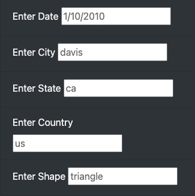
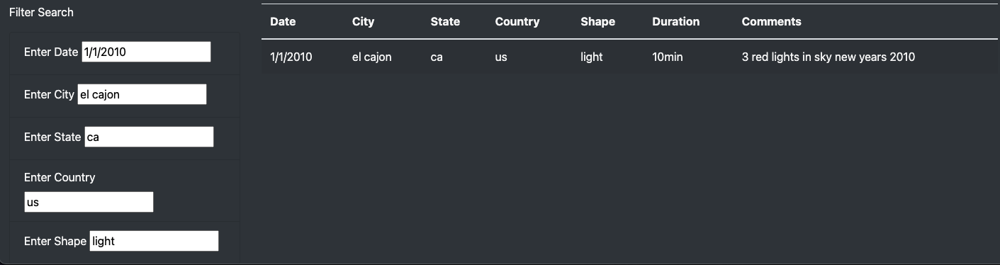

# UFOs

## Link to UFO webpage
https://joeyamyers.github.io/UFOs/

## Overview
### Purpose
The goal of this project is to create an interactive webpage that allows readers to parse the data around UFO sightings. I provided a more in-depth analysis of UFO sightings by allowing users to filter for multiple criteria at the same time. In addition to filtering based on the date, users will be able to add filters for the city, state, country, and shape of the ufo.

## Results
### Filtering
When users navigate to the webpage, they have the ability to filter the table based on the date, city, state, country, or shape. The user may choose to use all, some, or none of the filtering options. 

When a filtering option is used, the table will narrow down the visible entries to only include those that meet that specific condition. Below, I have include an image depicting this exact process. I filtered the table for each option provided and narrowed down the entire table to just one UFO occurence that met all the criteria. Users can duplicate this process to filter for whatever criteria suits their needs.

## Summary
### Drawbacks and Further Development
The current design of the webpage is serviceable, but additional changes would greatly increase the functionality for the user and their experience on the webpage. The biggest drawback is how there is currently not a way to easily clear all the filters the user inputted. By adding a button to clear all filters, the entire table of UFO data would be returned quickly and easily. Another aspect missing from the webpage is the ability to know how many rows are being returned. With a large dataset, this would be beneficial information for users to possess.

### Tools Used:
* JavaScript
* HTML
* CSS